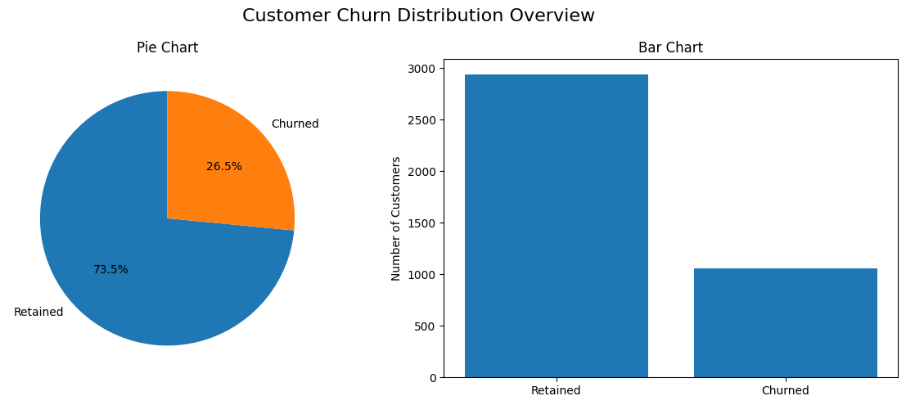

# Churn Prediction with Machine Learning

This repository contains a project for predicting customer churn using machine learning. The main goal is to develop a predictive model that identifies customers who are likely to stop doing business with a company.

## Table of Contents

1. [Project Overview](#project-overview)
2. [Dataset Description](#dataset-description)
3. [Installation](#installation)
4. [Usage](#usage)
5. [Project Structure](#project-structure)
6. [Results](#results)
7. [Contributing](#contributing)
8. [License](#license)

## Project Overview

Customer churn is a critical issue for many businesses. By predicting which customers are likely to churn, businesses can take proactive measures to retain them. This project demonstrates how machine learning models can be used to address this problem.

## Dataset Description

The dataset used in this project contains information about customers, their demographics, services they have subscribed to, and whether or not they have churned. The dataset includes features such as:

- Customer ID
- Gender
- Senior Citizen
- Partner
- Dependents
- Tenure
- Monthly Charges
- Total Charges
- Churn

The dataset is available in the `data/` directory.

## Installation

1. Clone this repository:

   ```bash
   git clone https://github.com/dmytrovoytko/ml-churn-prediction.git
   cd ml-churn-prediction
   ```

2. Install the required dependencies:

   ```bash
   pip install -r requirements.txt
   ```

## Usage

To run the project:

1. Preprocess the data:

   ```bash
   python preprocess.py
   ```

2. Train the machine learning model:

   ```bash
   python train_model.py
   ```

3. Evaluate the model:

   ```bash
   python evaluate_model.py
   ```

The results, including accuracy, precision, recall, and confusion matrix, will be saved in the `results/` directory.

## Project Structure

```
ml-churn-prediction/
|-- data/
|   |-- dataset.csv
|
|-- assets/
|   |-- example_chart.png
|
|-- src/
|   |-- preprocess.py
|   |-- train_model.py
|   |-- evaluate_model.py
|
|-- results/
|
|-- requirements.txt
|-- README.md
```

## Results

The final model achieved the following performance metrics:

- **Accuracy:** 85%
- **Precision:** 80%
- **Recall:** 75%



## Contributing

Contributions are welcome! Please submit a pull request or open an issue if you encounter any problems or have suggestions for improvement.

## License

This project is licensed under the MIT License. See the `LICENSE` file for details.
