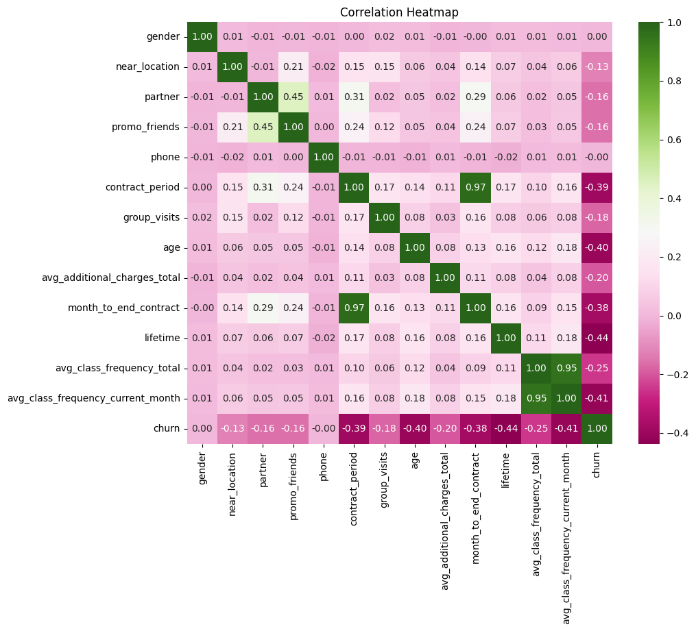
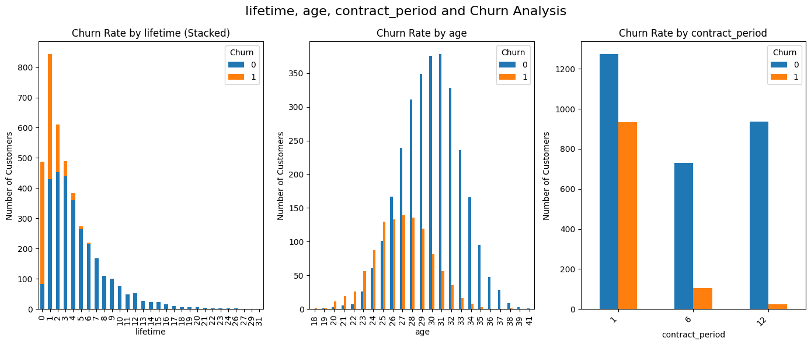
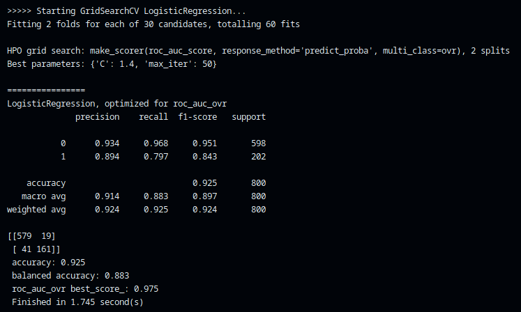

# 🚀 Churn Prediction with Machine Learning

This repository contains a project for predicting customer churn using machine learning. The main goal is to develop a predictive model that identifies customers who are likely to stop doing business with a company.

## 📋 Table of Contents

1. [📌 Project Overview](#project-overview)
2. [📊 Dataset Description](#dataset-description)
3. [⚙️ Installation](#installation)
4. [💻 Usage](#usage)
5. [📂 Project Structure](#project-structure)
6. [📈 Results](#results)
7. [📋 Detailed Workflow](#detailed-workflow)
8. [📊 Visualizations](#visualizations)
9. [🤝 Contributing](#contributing)
10. [📜 License](#license)

## 📌 Project Overview

Customer churn is a critical issue for many businesses. By predicting which customers are likely to churn, businesses can take proactive measures to retain them. This project demonstrates how machine learning models can be used to address this problem.

## 📊 Dataset Description

The dataset used in this project contains information about customers, their demographics, services they have subscribed to, and whether or not they have churned. The dataset includes features such as:

- 🆔 Customer ID
- 👨‍👩‍👧‍👦 Gender
- 👴 Senior Citizen
- 🤝 Partner
- 👶 Dependents
- 📅 Tenure
- 💵 Monthly Charges
- 💰 Total Charges
- ❌ Churn

The dataset is available in the `data/` directory.

## ⚙️ Installation

1. Clone this repository:

   ```bash
   git clone https://github.com/dmytrovoytko/ml-churn-prediction.git
   cd ml-churn-prediction
   ```

2. Install the required dependencies:

   ```bash
   pip install -r requirements.txt
   ```

## 💻 Usage

To run the project:

1. Preprocess the data:

   ```bash
   python preprocess.py
   ```

2. Train the machine learning model:

   ```bash
   python train_model.py
   ```

3. Evaluate the model:

   ```bash
   python evaluate_model.py
   ```

The results, including accuracy, precision, recall, and confusion matrix, will be saved in the `results/` directory.

## 📂 Project Structure

```
ml-churn-prediction/
|-- data/
|   |-- dataset.csv
|
|-- assets/
|   |-- example_chart.png
|
|-- src/
|   |-- preprocess.py
|   |-- train_model.py
|   |-- evaluate_model.py
|
|-- results/
|
|-- requirements.txt
|-- README.md
```

## 📈 Results

The final model achieved the following performance metrics:

- **✅ Accuracy:** 85%
- **🔍 Precision:** 80%
- **📉 Recall:** 75%


## 📋 Detailed Workflow

1. **Data Preprocessing**:
   - Handle missing values.
   - Encode categorical variables.
   - Scale numerical features for better model performance.

2. **Model Training**:
   - Multiple machine learning algorithms are tested, including logistic regression, decision trees, and random forests.
   - Hyperparameter tuning is performed using grid search or random search.

3. **Model Evaluation**:
   - Evaluate performance using accuracy, precision, recall, F1-score, and ROC-AUC.
   - Generate confusion matrices and classification reports for detailed analysis.

4. **Model Deployment**:
   - Export the trained model using joblib or pickle for deployment.

## 📊 Visualizations

Visualizations are a crucial part of understanding the data and the results. Here are some of the key plots included in the project:

- **Correlation Heatmap**:
  Visualize the relationship between features.

  

- **Feature Importance**:
  Understand which features contribute the most to the predictions.

  

- **ROC Curve**:
  Evaluate the trade-off between sensitivity and specificity.

  

- **Confusion Matrix**:
  Detailed view of true positives, false positives, true negatives, and false negatives.

  

## 🤝 Contributing

Contributions are welcome! Please submit a pull request or open an issue if you encounter any problems or have suggestions for improvement.

## 📜 License

This project is licensed under the MIT License. See the `LICENSE` file for details.

[DAte](https://example.com/dataset)


Clonez le dépôt sur votre machine locale :

```bash
git clone https://github.com/your-username/prediction-scores-manchester-city.git
cd prediction-scores-manchester-city


---

### **Explication des sections :**

1. **Titre du projet :**  
   Utilisez un titre accrocheur et clair. Vous pouvez ajouter un emoji pour le rendre visuellement attrayant. Par exemple, vous avez `# ⚽ Prédiction des Scores de Matchs de Manchester City`.

2. **Description du projet :**  
   Expliquez ce que fait le projet et quels sont ses objectifs. Par exemple, "Ce projet vise à prédire les scores des matchs de Manchester City en utilisant des modèles de Machine Learning..."

3. **Table des matières :**  
   Si votre README est long, vous pouvez créer une table des matières pour permettre une navigation facile. Chaque section sera liée par un `#` qui dirige l'utilisateur vers le contenu.

4. **Aperçu du projet :**  
   Donnez un aperçu détaillé de ce que fait le projet et comment vous allez le mettre en œuvre.

5. **Technologies utilisées :**  
   Listez toutes les bibliothèques ou outils que vous avez utilisés dans le projet (comme `Python`, `Pandas`, `Scikit-learn`, etc.).

6. **Installation :**  
   Expliquez comment les utilisateurs peuvent installer et préparer leur environnement pour faire fonctionner le projet.

7. **Démarrage rapide :**  
   Donnez des instructions sur la manière de commencer à utiliser le projet, comme l'ouverture du notebook Jupyter, l'exécution des scripts, etc.

8. **Résultats :**  
   Vous pouvez ajouter des graphiques, des captures d'écran, ou des liens vers des résultats spécifiques si nécessaire.

9. **Contact :**  
   Si quelqu'un a des questions ou souhaite collaborer, vous pouvez fournir vos informations de contact.

---

### **Étape 3 : Sauvegarder et vérifier**

1. **Sauvegarder le fichier :**  
   Une fois que vous avez rédigé le `README.md`, sauvegardez le fichier.

2. **Vérifier la mise en forme :**  
   Si vous utilisez un éditeur comme **VS Code**, vous pouvez voir le rendu en cliquant sur **Ctrl+Shift+V** (Windows/Linux) ou **Cmd+Shift+V** (Mac) pour prévisualiser la mise en forme du Markdown.

---

### **Étape 4 : Ajouter et pousser sur GitHub**

1. **Ajoutez le fichier README.md à Git :**

   Si vous utilisez Git pour gérer votre projet, vous pouvez maintenant ajouter et pousser le fichier sur votre dépôt GitHub :

   ```bash
   git add README.md
   git commit -m "Ajout du fichier README.md"
   git push origin main

[Ouvrir le notebook de formation du modèle](notebooks/model_training.ipynb)

[Voir mon profil GitHub](https://github.com/your-username)


Pour voir le projet en action, consultez le [notebook d'entraînement du modèle](notebooks/model_training.ipynb) dans le répertoire `notebooks`.


## Graphique des performances du modèle
Voici un graphique illustrant les résultats de notre modèle de prédiction des scores :


| Colonne 1   | Colonne 2   | Colonne 3   |
| ----------- | ----------- | ----------- |
| Valeur 1    | Valeur 2    | Valeur 3    |
| Valeur 4    | Valeur 5    | Valeur 6    |


## Résultats des prédictions

Voici un tableau comparant les scores réels et les scores prévus pour certains matchs :

| Match                   | Score réel | Score prédit |
| ----------------------- | ---------- | ------------ |
| Manchester City vs Chelsea | 2-1        | 2-0          |
| Manchester City vs Liverpool | 3-0        | 3-1          |
| Manchester City vs Arsenal | 1-1        | 1-0          |


def predire_scores():
    # Code pour prédire les scores
    return prediction


## 🚀 Démarrage rapide
## 📊 Résultats
## 💻 Installation


import matplotlib.pyplot as plt

# Création d'un graphique simple
plt.plot([1, 2, 3], [4, 5, 6])
plt.title('Graphique des scores')
plt.savefig('assets/graphique.png')  # Sauvegarder dans le dossier assets


[Ouvrir le script `train_model.py`](scripts/train_model.py)


## 🚀 Démarrage rapide

Les emojis peuvent être ajoutés facilement en utilisant leur code Unicode ou en copiant directement l'emoji.

2.1. Ajouter un emoji dans un titre
Vous pouvez ajouter des emojis directement dans les titres de votre README.md. Il suffit de copier l'emoji depuis un site comme Emojipedia et de le coller dans votre titre.

Exemple :


---

### **Résumé des étapes pour ajouter ces éléments :**
1. **Code** : Utilisez les backticks (`` ` ``) pour le code en ligne et les triplets de backticks (```` ``` ````) pour les blocs de code.
2. **Emojis** : Copiez directement l'emoji ou utilisez son code Unicode pour l'ajouter dans les titres.
3. **Graphiques** : Sauvegardez les graphiques dans un dossier (par exemple `assets/`) et utilisez `` pour les ajouter dans le `README.md`.
4. **Liens** : Utilisez `[texte du lien](URL)` pour créer des liens vers des fichiers locaux ou des pages externes.

---

Si vous avez d'autres questions ou des demandes spécifiques, n'hésitez pas à demander ! 😊


